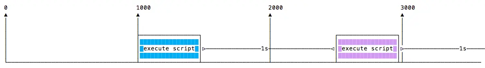

# Table of Contents

- [자바스크립트 타이머 이해하기](#자바스크립트-타이머-이해하기)
  - [setTimeout() 함수](#settimeout-함수)
    - [0초 지연](#0초-지연)
  - [setInterval() 함수](#setinterval-함수)
  - [재귀적 setTimeout](#재귀적-settimeout)

# 자바스크립트 타이머 이해하기

## setTimeout() 함수

자바스크립트로 프로그래밍할 때 특정 함수의 실행을 지연시켜야 할 경우가 있다. 이런 경우 `setTimeout`을 사용한다. 나중에 실행할 콜백 함수와 지연 시간(밀리초 단위)을 지정하면 된다:

```javascript
setTimeout(() => {
  // 2초 후 실행
}, 2000);

setTimeout(() => {
  // 50밀리초 후 실행
}, 50);
```

이 문법은 새로운 함수를 정의한다. 콜백 함수 내에서 다른 함수를 호출할 수 있고, 기존 함수의 이름과 인자를 전달할 수도 있다:

```javascript
const myFunction = (firstParam, secondParam) => {
  // 작업 수행
};

// 2초 후 실행
setTimeout(myFunction, 2000, firstParam, secondParam);
```

`setTimeout`은 타이머 ID를 반환한다. 이 값은 보통 사용하지 않지만, 예약된 함수 실행을 취소하고 싶을 때 이 ID를 저장해두고 사용할 수 있다:

```javascript
const id = setTimeout(() => {
  // 2초 후 실행되어야 함
}, 2000);

// 실행 취소
clearTimeout(id);
```

### 0초 지연

지연 시간을 0으로 지정하면 콜백 함수는 현재 함수 실행이 끝난 직후 최대한 빨리 실행된다:

```javascript
setTimeout(() => {
  console.log('실행 후 ');
}, 0);

console.log(' 실행 전 ');
```

이 코드는 다음과 같이 출력된다:

```bash
실행 전
실행 후
```

이는 CPU를 많이 사용하는 작업을 처리할 때 특히 유용하다. 무거운 계산을 수행하면서도 다른 함수가 실행될 수 있도록 스케줄러에 함수를 대기시킬 수 있다.

> IE와 Edge 브라우저는 동일한 기능을 하는 `setImmediate()` 메서드를 구현했지만, 이는 표준이 아니며 다른 브라우저에서는 사용할 수 없다. 하지만 Node.js에서는 표준 함수로 제공된다.

## setInterval() 함수

`setInterval`은 `setTimeout`과 유사하지만 한 가지 차이점이 있다. 콜백 함수를 한 번만 실행하는 것이 아니라, 지정한 시간 간격(밀리초 단위)마다 계속해서 실행한다:

```javascript
setInterval(() => {
  // 2초마다 실행
}, 2000);
```

위 함수는 `clearInterval`로 중지하기 전까지 2초마다 계속 실행된다. `setInterval`이 반환한 인터벌 ID를 `clearInterval`에 전달하여 중지할 수 있다:

```javascript
const id = setInterval(() => {
  // 2초마다 실행
}, 2000);

clearInterval(id);
```

setInterval 콜백 함수 내에서 `clearInterval`을 호출하여 함수가 자동으로 다시 실행될지 중지할지 결정하는 것이 일반적이다. 예를 들어 다음 코드는 `App.somethingIWait` 값이 'arrived'가 될 때까지 작업을 수행한다:

```javascript
const interval = setInterval(() => {
  if (App.somethingIWait === 'arrived') {
    clearInterval(interval);
  }
  // 그 외의 작업 수행
}, 100);
```

## 재귀적 setTimeout

`setInterval`은 함수의 실행 완료 여부와 관계없이 지정된 시간마다 함수를 시작한다.

함수 실행 시간이 항상 동일하다면 문제가 없다:


하지만 네트워크 상태 등에 따라 함수 실행 시간이 달라질 수 있다:


그리고 긴 실행 시간이 다음 실행과 겹칠 수도 있다:


이를 방지하기 위해 콜백 함수가 완료될 때 재귀적으로 `setTimeout`을 호출할 수 있다:

```javascript
const myFunction = () => {
  // 작업 수행

  setTimeout(myFunction, 1000);
};

setTimeout(myFunction, 1000);
```

이렇게 하면 다음과 같은 실행 흐름이 된다:



`setTimeout`과 `setInterval`은 Node.js에서도 [타이머 모듈](https://nodejs.org/api/timers.html)을 통해 사용할 수 있다.

Node.js는 `setTimeout(() => {}, 0)`과 동일한 `setImmediate()`도 제공하는데, 이는 주로 Node.js 이벤트 루프와 함께 작업할 때 사용된다.