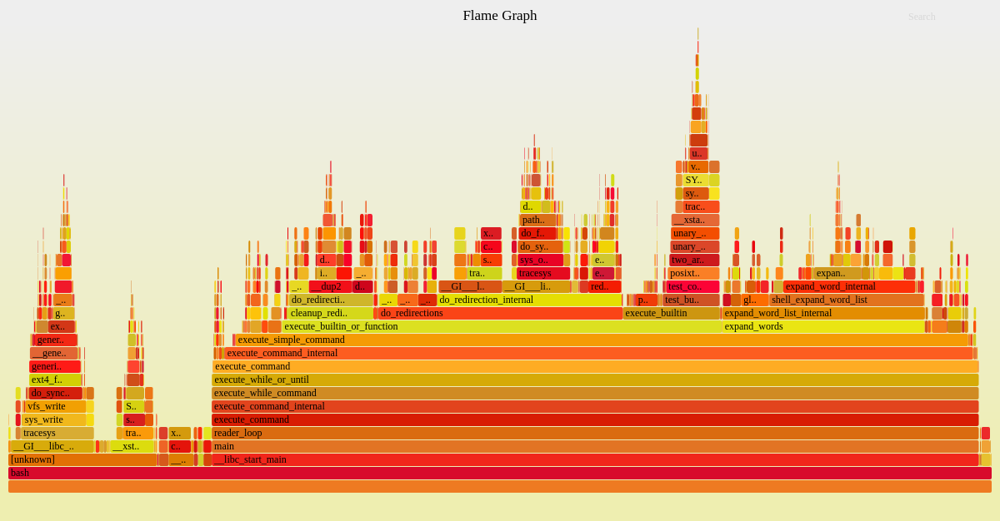

# Linux Perf 도구 사용하기

[Linux Perf](https://perf.wiki.kernel.org/index.php/Main_Page)는 자바스크립트, 네이티브, OS 수준의 프레임을 포함한 저수준 CPU 프로파일링 기능을 제공한다.

**중요**: 이 가이드는 리눅스 환경에서만 사용할 수 있다.

## 사용 방법

Linux Perf는 일반적으로 `linux-tools-common` 패키지를 통해 설치할 수 있다. Node.js 애플리케이션에서 _perf_events_를 지원하려면 `--perf-basic-prof` 또는 `--perf-basic-prof-only-functions` 옵션을 사용한다.

`--perf-basic-prof` 옵션은 항상 파일(/tmp/perf-PID.map)에 기록하므로 디스크 공간이 무한히 증가할 수 있다. 이를 방지하려면 [linux-perf](https://www.npmjs.com/package/linux-perf) 모듈을 사용하거나 `--perf-basic-prof-only-functions` 옵션을 선택한다.

두 옵션의 주요 차이점은 `--perf-basic-prof-only-functions`가 더 적은 출력을 생성한다는 점이다. 이는 프로덕션 환경에서 프로파일링할 때 유용한 선택이 될 수 있다.

```bash
# 애플리케이션을 실행하고 PID 확인
$ node --perf-basic-prof-only-functions index.js &
[1] 3870
```

그런 다음 원하는 주기로 이벤트를 기록한다:

```bash
$ sudo perf record -F 99 -p 3870 -g
```

이 단계에서는 신뢰할 수 있는 분석을 위해 더 많은 기록을 생성하도록 애플리케이션에 부하 테스트를 수행하는 것이 좋다. 작업이 완료되면 perf 프로세스를 SIGINT(Ctrl-C)로 종료한다.

`perf`는 각 함수 호출의 추적 정보를 포함하는 파일을 `/tmp` 폴더에 생성한다. 일반적으로 파일명은 `/tmp/perf-PID.map` 형식이다(위 예제에서는 `/tmp/perf-3870.map`).

이러한 결과를 특정 파일로 집계하려면 다음 명령을 실행한다:

```bash
$ sudo perf script > perfs.out
```

```bash
$ cat ./perfs.out
node 3870 25147.878454:          1 cycles:
        ffffffffb5878b06 native_write_msr+0x6 ([kernel.kallsyms])
        ffffffffb580d9d5 intel_tfa_pmu_enable_all+0x35 ([kernel.kallsyms])
        ffffffffb5807ac8 x86_pmu_enable+0x118 ([kernel.kallsyms])
        ffffffffb5a0a93d perf_pmu_enable.part.0+0xd ([kernel.kallsyms])
        ffffffffb5a10c06 __perf_event_task_sched_in+0x186 ([kernel.kallsyms])
        ffffffffb58d3e1d finish_task_switch+0xfd ([kernel.kallsyms])
        ffffffffb62d46fb __sched_text_start+0x2eb ([kernel.kallsyms])
        ffffffffb62d4b92 schedule+0x42 ([kernel.kallsyms])
        ffffffffb62d87a9 schedule_hrtimeout_range_clock+0xf9 ([kernel.kallsyms])
        ffffffffb62d87d3 schedule_hrtimeout_range+0x13 ([kernel.kallsyms])
        ffffffffb5b35980 ep_poll+0x400 ([kernel.kallsyms])
        ffffffffb5b35a88 do_epoll_wait+0xb8 ([kernel.kallsyms])
        ffffffffb5b35abe __x64_sys_epoll_wait+0x1e ([kernel.kallsyms])
        ffffffffb58044c7 do_syscall_64+0x57 ([kernel.kallsyms])
        ffffffffb640008c entry_SYSCALL_64_after_hwframe+0x44 ([kernel.kallsyms])
....
```

원시 출력은 이해하기 어려울 수 있으므로, 일반적으로 이 파일을 사용하여 더 나은 시각화를 위한 플레임 그래프를 생성한다.



이 결과로 플레임 그래프를 생성하려면 [이 튜토리얼](/learn/diagnostics/flame-graphs#create-a-flame-graph-with-system-perf-tools)의 6단계부터 따라하면 된다.

`perf`는 Node.js 전용 도구가 아니기 때문에 Node.js에서 자바스크립트 코드가 최적화되는 방식과 관련하여 문제가 발생할 수 있다. 자세한 내용은 [perf 출력 문제](/learn/diagnostics/flame-graphs#perf-output-issues)를 참고한다.

## 유용한 링크

- /learn/diagnostics/flame-graphs
- https://www.brendangregg.com/blog/2014-09-17/node-flame-graphs-on-linux.html
- https://perf.wiki.kernel.org/index.php/Main_Page
- https://blog.rafaelgss.com.br/node-cpu-profiler